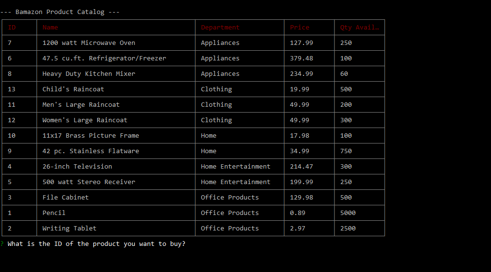

# Bamazon
Following are screenshots showing the app.

There is also a video in the /img folder showing the initial database creation with the SQL script in the /sql folder but I could not get a link to it to work in this Markdown file.

# bamazonCustomer.js app

First set of screenshots are for the bamazonCustomer.js app.

* First is the initial display of the product catalog

* Next is following a purchase with the total purchase price noted

* Next is another display of the product catalog showing
that the purchased items have been removed from inventory

* Next is an attempt to purchase a quantity more than existing inventory with explanatory message

* Next shows allowable quantity purchase 

* And finally the table showing all product inventory purchased and handling of an invalid product id specification

# bamazonManager.js app

Second set of screenshots are for the bamazonManager.js app.

* First is the initial display of admin functions available to the manager

* Next is the table for viewing all products for sale

* Next is the table showing only those products with low inventory

* Next shows adding inventory to an item

* And then the table of products showing that the inventory has been added to the item

* Last is the first phase of adding a new product to the database; notice the prompt list of departments to which a new product can be added

* Followed by the completion of the data for the addition of the new product to the database

* And finally the complete products table showing that the new product has actually been added to the database

# bamazonExecutive.js app

Final set of screenshots are for the bamazonExecutive.js app.

* First is the initial display of admin functions available to the executive

* Next is the table showing total sales by department; as per the homework instructions, the Total Profit column is a computed Alias column

* Next shows the input of data for the creation of a new department

* And then a table showing all departments with the newly created department added

* Next is from the bamazonManager.js app and shows adding a new product to the catalog; notice that the list of departments to which the product can be assigned now includes the department added by the bamazonExecutive.js app

* And then the completion of adding a new product in the bamazonManager.js app

* Finally in the bamazonCustomer.js app, the new product in the new department shown in the product catalog for sale

